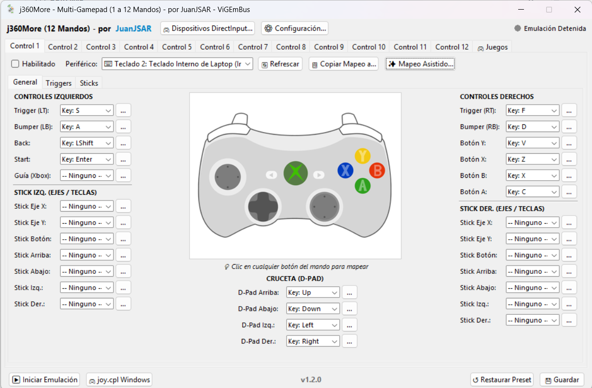
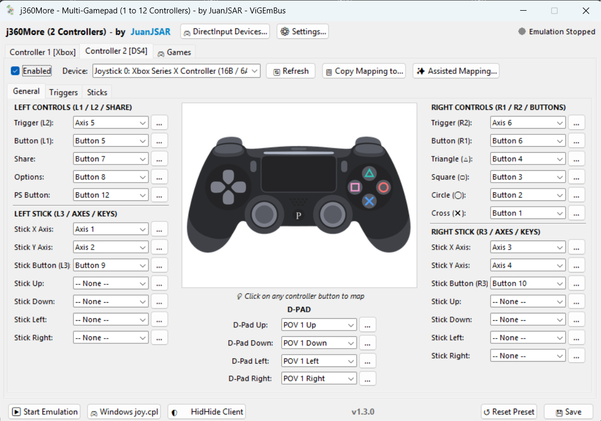
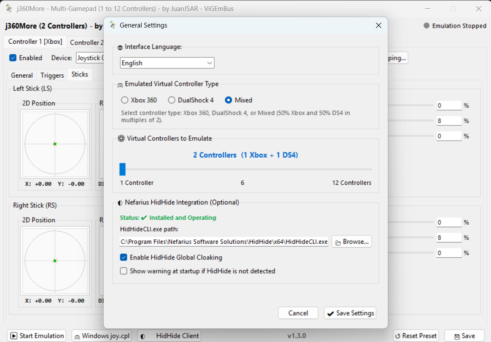

# j360More - Multi-Gamepad Emulator (Xbox 360, Xbox One, PS4, PS5 & Switch 2 Pro)

[📖 Leer en Español](README_es.md) | [Official Releases](https://github.com/JuanJSAR93/j360More-Xbox_360_Controller_Emulator/releases) | [Web Documentation](https://juanjsar93.github.io/j360More-Xbox_360_Controller_Emulator/)

> **Developed by JuanJSAR**  
> Official Repository: [GitHub - JuanJSAR93/j360More](https://github.com/JuanJSAR93/j360More-Xbox_360_Controller_Emulator)  
> Downloads & Releases: [Official Releases](https://github.com/JuanJSAR93/j360More-Xbox_360_Controller_Emulator/releases)  
> Web Documentation (GitHub Pages): `/docs` folder

**j360More** is an advanced multi-controller virtual gamepad solution developed by **JuanJSAR**. Supporting both **VIIPER** (multiplatform USB/IP) and **ViGEmBus** backends, it features a modern bilingual interface (**English and Spanish**), an intuitive layout inspired by x360ce, support for up to **12 simultaneous virtual controllers** (**Xbox 360**, **Xbox One**, **PlayStation 4 DualShock 4**, **PlayStation 5 DualSense**, and **Nintendo Switch 2 Pro**), and optional integration with **Nefarius HidHide** to eliminate the double-input issue in PC games and emulators.

Designed with cross-platform architecture: running natively on **Windows (10/11)** with full **Linux support (Beta)** powered by VIIPER and the standard USB/IP protocol!

Map real physical hardware (DirectInput/XInput gamepads via USB or Bluetooth, generic arcade sticks, steering wheels, keyboard and mouse) to each virtual controller, calibrate analog response curves in real time, and monitor reactive input feedback directly on an interactive vector diagram.

---

## 📸 Application Screenshots

| Xbox 360 Mapping | DualShock 4 Mapping |
|:---:|:---:|
| [](assets/screenshot_main.png) | [](assets/screenshot_main2.png) |
| **Analog Sticks Calibration** | **Settings & Driver Selection** |
| [](assets/screenshot_sticks.png) | [](assets/screenshot_settings.png) |

---

## 🎮 Key Features

### 1. Extended Support for 1 to 12 Simultaneous Controllers
- Adjust the number of active virtual gamepads (from 1 to 12) from the **`⚙ Settings...`** modal.
- Dedicated, independent tabs for each player (`Controller 1` to `Controller 12`).

### 2. Dual Emulation Driver Backends (VIIPER & ViGEmBus)
- **VIIPER Driver Backend (Recommended / Default for new installs)**:
  - Modern cross-platform architecture utilizing USB/IP.
  - Powered by a custom, modified build of [JuanJSAR93/VIIPER](https://github.com/JuanJSAR93/VIIPER) (forked from [Alia5/VIIPER](https://github.com/Alia5/VIIPER)) adding native **Xbox One (GIP protocol)** support and precise virtual device localization/enumeration.
  - Bundled directly inside `bin/viiper.exe` — launched and managed automatically by the application.
  - Unlocks emulation of **Xbox 360**, **Xbox One (GIP)**, **PlayStation 4 (DualShock 4)**, **PlayStation 5 (DualSense)**, and **Nintendo Switch 2 Pro (`ns2pro`)**.
  - Paves the way for seamless **Linux support (Beta)** using the Linux kernel's built-in `usbip` modules.
- **ViGEmBus Driver Backend**:
  - Legacy Windows kernel-mode driver supporting **Xbox 360**, **DualShock 4**, and **Mixed** modes.
  - 100% backward-compatible: existing configuration files keep ViGEmBus automatically unless changed by the user.

### 3. Multi-Console Emulation Support
- **Xbox 360 (XInput)**: The ubiquitous PC standard for Steam, Game Pass, and legacy/modern titles.
- **Xbox One (GIP / XInput)**: Emulated using the official Microsoft **General Input Protocol (GIP)** via VIIPER (`authorized-xboxone`). Enumerated directly by Windows PnP as an authentic native Xbox One controller and exposed via standard XInput with high compatibility for modern PC titles, Microsoft Store, and Xbox Game Pass.
- **PlayStation 4 (DualShock 4)**: DirectInput / Sony HID with native PlayStation button icons in supported games.
- **PlayStation 5 (DualSense)**: Full next-gen Sony layout emulation with bumper/trigger responsiveness.
- **Nintendo Switch 2 Pro (`ns2pro`)**: Authentic Nintendo layout (B/A, Y/X, L/ZL, R/ZR, -, +, Home), normalized $0 \dots 4095$ range with precision centering at $2048$.
- **Mixed Mode**: Automatically emulates half as Xbox 360/Xbox One and half as PlayStation/Nintendo gamepads for mixed multiplayer setups.

### 4. Cross-Platform Vision: Windows & Linux (Beta)
- **Windows**: Ready out of the box with `usbip-win2` or `ViGEmBus`.
- **Linux (Beta)**: Using native Linux USB/IP kernel modules (`usbip` / `vhci-hcd`), native ELF binary, and the Linux build of the VIIPER daemon.

### 5. Smart Activation & Virtual Controller Filtering
- **Zero Phantom Controllers**: Only assigned and enabled controller tabs spawn virtual gamepads.
- **Accurate Virtual vs. Physical Device Identification**: Powered by our customized VIIPER build and Windows PnP tree traversal (`cfgmgr32.dll`), the device manager inspects hardware bus roots and runtime descriptions to reliably distinguish emulated gamepads from genuine physical hardware. This completely fixes the legacy issue where physical Xbox 360, DualShock 4, DualSense, and Switch controllers were falsely flagged as virtual devices.

### 6. Built-in Bilingual Interface (English & Spanish)
- Complete localization for every menu, dialog, system prompt, device table, and hardware inspection view.
- Easily toggle languages at any time via **`⚙ Settings...`** -> **`Interface Language`**.

### 7. Optional Nefarius HidHide Integration (Anti Double-Input)
- **Completely Optional**: If HidHide is not installed on your system, j360More works normally for virtual controller emulation.
- **Dynamic Cloaking**: Clicking **`▶ Start Emulation`** cloaks selected physical devices for all Windows applications, allowing **only j360More** to read them (via automatic process whitelisting). Stopping emulation instantly restores visibility.

### 8. Interactive Vector Diagrams & Real-Time LEDs
- High-fidelity vector rendering for both **Xbox 360** and **DualShock 4 / PS5 / Switch** layouts.
- **Click-to-Map**: Click directly on any button or stick on the controller illustration to trigger instant button mapping.
- **Reactive Glow LEDs**: Every button press, trigger pull, D-pad direction, or stick motion illuminates in real time.

### 9. Specialized Analog Calibration for Triggers & Sticks
- **`Triggers` Tab (LT / RT / ZL / ZR / L2 / R2)**: Real-time quadratic input response curves with Dead Zone, Anti-Dead Zone, Sensitivity, and Invert controls.
- **`Sticks` Tab (Left & Right Sticks)**: 2D Cartesian display with grid, live green position indicator, Dead Zone circle, Anti-Dead Zone circle, radial sensitivity response curve, and X/Y inversion.

### 10. Independent Multi-Keyboard Support (Zero Cross-Talk)
- Connect multiple physical USB/Bluetooth keyboards and map them to separate player slots without keystroke bleeding, powered by Windows Raw Input.

---

## 📋 System Requirements

### Operating System:
- **Windows 10 / 11 (64-bit)** (Supported now)
- **Linux (x86_64)** (*Beta via native ELF binary and USB/IP*)

### Driver Requirements:
Choose one of the two supported backends:
1. **VIIPER Backend (Default / Multiplatform)**:
   - `bin/viiper.exe` is already bundled with the application.
   - Requires the **usbip-win2** driver installed on Windows (`C:\Program Files\USBip`).
   - Official Download: [usbip-win2 Releases (GitHub)](https://github.com/vadimgrn/usbip-win2/releases)
2. **ViGEmBus Backend (Windows Only)**:
   - Requires the **ViGEmBus** driver installed on Windows.
   - Official Download: [ViGEmBus Releases (GitHub)](https://github.com/nefarius/ViGEmBus/releases)

> **❓ Why is it mandatory to install usbip-win2 or ViGEmBus?**  
> Windows does not permit applications to spawn virtual input devices without a signed system-level driver.  
> - **If using VIIPER (default)**: you need the **usbip-win2** driver to bridge and expose gamepads via USB/IP (supporting Xbox 360, Xbox One GIP, DualShock 4, DualSense, and Switch 2 Pro).  
> - **If using ViGEmBus (classic alternative)**: you need the **ViGEmBus** driver (supporting Xbox 360 and DualShock 4).  
> Without at least one of these installed, Windows cannot instantiate virtual controllers for your games.

### Optional:
- **Nefarius HidHide**: Prevents double-input in games when using physical DirectInput controllers.
  - Official Download: [HidHide Releases (GitHub)](https://github.com/nefarius/HidHide/releases)

---

## 🛠 Installation & Running from Source

### 1. Clone the repository
```powershell
git clone https://github.com/JuanJSAR93/j360More-Xbox_360_Controller_Emulator.git
cd j360More-Xbox_360_Controller_Emulator
```

### 2. Create and Activate a Virtual Environment
```powershell
python -m venv venv
.\venv\Scripts\activate
```

### 3. Install Dependencies
```powershell
pip install -r requirements.txt
```

### 4. Run the Application
```powershell
python gui_app.py
```

---

## 📦 Building Standalone Executables

### Windows:
To compile the standalone portable executable (`dist\j360More.exe`) with the official icon, version metadata, and bundled VIIPER daemon:
```cmd
build_windows.bat
```

### Linux (Docker):
To compile the native Linux ELF executable and release archive (`dist/j360More` and `dist/j360More-v1.5.1-linux-amd64.tar.gz`):
```cmd
build_linux.bat
```
*(On Linux host environments, run `./build_linux.sh` directly)*

---

## 📂 Project Structure

```text
xbox_multi_emulator/
├── assets/                     # Visual assets and icons (SVG, ICO, PNG)
│   ├── icon.svg                # Official project vector icon
│   ├── icon.ico                # Multi-resolution compiled Windows icon
│   ├── controller_360.svg      # Xbox 360 detailed vector diagram
│   ├── controller_DS4.svg      # PlayStation 4 vector diagram
│   ├── controller_DS5.svg      # PlayStation 5 vector diagram
│   └── web_pad/                # AirPad HTML5/JS touch virtual gamepad interface
├── bin/                        # Auxiliary backend binaries
│   ├── viiper-amd64.exe        # VIIPER USB/IP emulation server (Windows x64 / AMD64)
│   ├── viiper_arm64.exe        # VIIPER USB/IP emulation server (Windows ARM64)
│   ├── viiper-amd64            # VIIPER USB/IP emulation server (Linux x86_64 / AMD64)
│   └── viiper-arm64            # VIIPER USB/IP emulation server (Linux ARM64 / AArch64)
├── docs/                       # Official GitHub Pages website (Bilingual)
│   ├── assets/                 # Web visual assets
│   ├── index.html              # Main landing page
│   ├── script.js               # Interactive logic & language toggle
│   └── styles.css              # Cyber Gaming UI styles
├── dist/                       # Output distribution
│   ├── j360More.exe            # Standalone Windows portable executable
│   ├── j360More-*-windows-amd64.zip # Windows AMD64 release package (j360More.exe + viiper-amd64.exe)
│   ├── j360More-*-windows-arm64.zip # Windows ARM64 release package (j360More.exe + viiper_arm64.exe)
│   ├── j360More-*-linux-amd64.tar.gz # Linux AMD64 release package (j360More + viiper-amd64)
│   └── j360More-*-linux-arm64.tar.gz  # Linux ARM64 release package (j360More + viiper-arm64)
├── config_mapping.json         # Base configuration in JSON
├── driver_manager.py           # ViGEmBus, VIIPER and HidHide driver detection
├── emulator.py                 # Entry point & console/test modes
├── emulator_engine.py          # 120Hz hybrid emulation loop (ViGEmBus & VIIPER)
├── gui_app.py                  # Main Tkinter/TTK graphical user interface & splash screen
├── i18n.py                     # Internationalization module (Multi-language)
├── input_devices.py            # SDL2 hotplug detection, PnP correlation and virtual device filtering
├── raw_keyboard.py             # Multi-keyboard Raw Input manager (Zero Cross-Talk)
├── viiper_backend.py           # Native VIIPER IPC/TCP client for Xbox 360, Xbox One (GIP), DS4, PS5 & Switch 2
├── web_gamepad_server.py       # AirPad WebSocket & HTTP server for mobile gamepads
├── version_info.txt            # Executable metadata and copyright info
└── requirements.txt            # Python dependencies
```

---

## 📄 License & Credits
- **Creator & Lead Developer**: **JuanJSAR** ([@JuanJSAR93](https://github.com/JuanJSAR93))
- **VIIPER**: Developed by Alia5 ([Original VIIPER on GitHub](https://github.com/Alia5/VIIPER)), enabling cross-platform virtual USB gamepad emulation via USB/IP. **j360More** bundles and maintains an enhanced, modified build by JuanJSAR ([JuanJSAR93/VIIPER: Virtual Input over IP Emulator](https://github.com/JuanJSAR93/VIIPER)) with native Xbox One GIP support and proper PnP device localization.
- **usbip-win2**: Developed by vadimgrn ([usbip-win2 on GitHub](https://github.com/vadimgrn/usbip-win2)).
- **ViGEmBus & HidHide**: Created by Benjamin Höglinger-Stelzer (Nefarius Software Solutions).
- **pygame-ce (SDL2)**: Powering hot-plug detection and input handling.
- Built for local multiplayer PC gaming enthusiasts worldwide.
