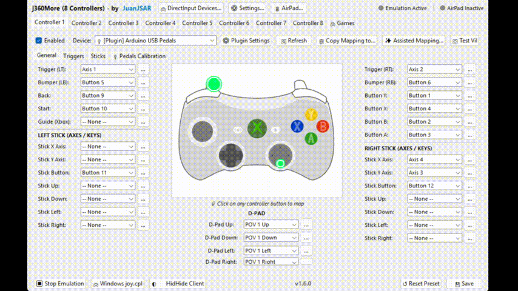
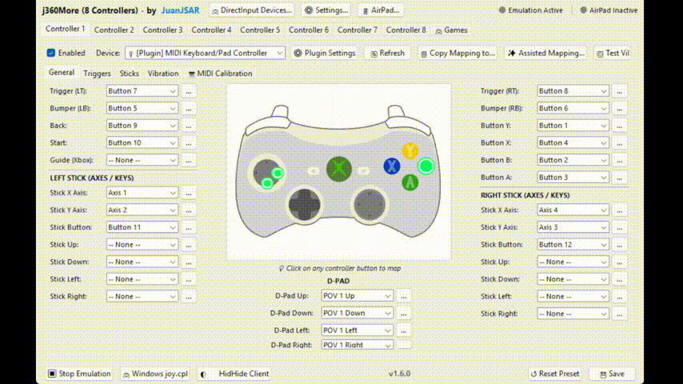

# j360More Extensible Plugin System — Comprehensive Development & Real Hardware Guide

Welcome to the official developer and hardware creator documentation for the **j360More** plugin system.

This guide covers everything from core architecture to building custom plugins from scratch, designing declarative user interfaces without writing GUI code, and connecting **real physical hardware** (Arduino/ESP32 and USB-MIDI keyboards/pads) without relying on emulation.

---

## Table of Contents

1. [System Architecture and Philosophy](#1-system-architecture-and-philosophy)
   - [Process Isolation and IPC](#11-process-isolation-and-ipc)
   - [Automated Virtual Environment (.venv)](#12-automated-virtual-environment-venv)
2. [Plugin Anatomy and Creation Step-by-Step](#2-plugin-anatomy-and-creation-step-by-step)
   - [Directory Structure](#21-directory-structure)
   - [The Manifest (`plugin.json`)](#22-the-manifest-pluginjson)
   - [Execution Lifecycle](#23-execution-lifecycle)
   - [Autostart Management (Enable / Disable on Boot)](#24-autostart-management-enable--disable-on-boot)
3. [Declarative Custom User Interfaces (UI)](#3-declarative-custom-user-interfaces-ui)
   - [Global Settings Dialog (`global_ui`)](#31-global-settings-dialog-global_ui)
   - [Dynamic Dropdowns (`dynamic_dropdown`) with Live Scan](#32-dynamic-dropdowns-with-live-scan)
   - [Per-Pad Custom Tabs (`pad_ui_customization`)](#33-per-pad-custom-tabs-pad_ui_customization)
   - [Real-Time Telemetry Monitors (`progress_bar_multi`)](#34-real-time-telemetry-monitors-progress_bar_multi)
4. [Multi-Language Support (i18n)](#4-multi-language-support-i18n)
   - [Inline Approach in `plugin.json`](#41-inline-approach-in-pluginjson)
   - [Modular Approach with `locales/` Files](#42-modular-approach-with-locales-files)
5. [Real Physical Hardware 1: Arduino / ESP32 (Pedals, Wheels, Handbrake)](#5-real-physical-hardware-1-arduino--esp32-pedals-wheels-handbrake)
   - [Circuit and Pin Wiring](#51-circuit-and-pin-wiring)
   - [Full Arduino C++ Firmware (`pedals_firmware.ino`)](#52-full-arduino-c-firmware-pedals_firmwareino)
   - [Python Plugin Script (`main.py`)](#53-python-plugin-script-mainpy)
6. [Real Physical Hardware 2: Synthesizers, Pianos, and MIDI Pads](#6-real-physical-hardware-2-synthesizers-pianos-and-midi-pads)
   - [Filtering Ports on Windows (Input vs Output)](#61-filtering-ports-on-windows-input-vs-output)
   - [Real-Time Polling with `pygame.midi`](#62-real-time-polling-with-pygamemidi)
   - [Mapping Pitch Bend, Modulation Wheel, and Keys to Xbox Controls](#63-mapping-pitch-bend-modulation-wheel-and-keys-to-xbox-controls)
7. [Complete Python SDK Reference (`PluginDevice`)](#7-complete-python-sdk-reference-plugindevice)
   - [Initialization and Connection Status](#71-initialization-and-lifecycle)
   - [Semantic Xbox Controls vs Indexed Controls](#72-semantic-xbox-controls-recommended)
   - [Atomic Synchronization and Telemetry](#74-atomic-state-synchronization)
   - [Bidirectional Event Decorators](#75-bidirectional-event-decorators)
8. [Hot-Plug, Disconnection, and Auto-Reconnection Management](#8-hot-plug-disconnection-and-auto-reconnection-management)
   - [The Two Link Levels: IPC vs Physical Hardware](#81-the-two-link-levels-ipc-vs-physical-hardware)
   - [Preventing Stuck Inputs with `set_connected(False)` and `reset_inputs()`](#82-preventing-stuck-inputs-with-set_connectedfalse-and-reset_inputs)
   - [Non-Blocking Auto-Reconnection Loop Pattern](#83-non-blocking-auto-reconnection-loop-pattern)
   - [Dynamic Multi-Device Reporting with `report_devices()`](#84-dynamic-multi-device-reporting-with-report_devices)
9. [Troubleshooting and Diagnostics](#9-troubleshooting-and-diagnostics)

---

## 1. System Architecture and Philosophy

The **j360More** plugin engine was engineered around a core principle: **maximum stability with zero impact on gameplay latency**.

### 1.1. Process Isolation and IPC

Traditionally, loading third-party scripts into the main execution thread of an emulator or GUI framework risks freezing player inputs whenever a blocking I/O call occurs (such as waiting for serial COM buffer data or socket timeouts).

In j360More:
1. Every active plugin runs in its own child process (`subprocess.Popen`) using the dedicated virtual environment Python interpreter.
2. Inter-Process Communication (IPC) is handled via lightweight local TCP sockets (`127.0.0.1`) transferring compact JSON packets.
3. The virtual controller dispatch loop runs at **120 Hz**, reading shared state within microseconds to guarantee that any external physical hardware delay will never degrade other controllers' performance.

```
┌────────────────────────────────────────────────────────┐
│               j360More Core (120 Hz)                   │
│   - ViGEmBus / VIIPER Dispatcher                       │
│   - Tkinter GUI with Telemetry Monitor (~33 FPS)       │
│   - Local TCP IPC Server (127.0.0.1:AssignedPort)      │
└──────────────────────────┬─────────────────────────────┘
                           │ JSON TCP Socket
        ┌──────────────────┴──────────────────┐
        ▼                                     ▼
┌───────────────────────────┐     ┌───────────────────────────┐
│ Plugin 1 (Child Process)  │     │ Plugin 2 (Child Process)  │
│ - Arduino Pedals          │     │ - USB-MIDI Controller     │
│ - pyserial @ 115200 baud  │     │ - pygame.midi @ 120 Hz    │
└───────────────────────────┘     └───────────────────────────┘
```

### 1.2. Automated Virtual Environment (`.venv`)

To ensure end users never need to install Python globally or manage terminal commands:
- When opening the `🔌 Plugins` tab, j360More checks for `plugins/.venv`.
- If missing or lacking packages, the interface cleanly displays a notice with a single-click button: **"Install Plugin Dependencies"**.
- Dependencies are isolated from the OS.
- For MIDI controllers, `pygame-ce` is used instead of packages requiring external C++ compilers, ensuring trouble-free installation across Windows 10 and 11.

---

## 2. Plugin Anatomy and Creation Step-by-Step

### 2.1. Directory Structure

Each plugin resides in its own folder inside `plugins/`:

```
plugins/
└── my_device/
    ├── plugin.json         # Metadata, declarative UI schema, and options
    ├── main.py             # Main executable Python script
    ├── requirements.txt    # PyPI requirements (e.g. pyserial, pygame-ce)
    └── locales/            # (Optional) External translations
        ├── en.json
        └── es.json
```

### 2.2. The Manifest (`plugin.json`)

The `plugin.json` file declares your plugin, provided devices, and user-configurable parameters:

```json
{
  "id": "my_device",
  "name": "My Custom Device",
  "version": "1.0.0",
  "author": "Your Name",
  "description": "Custom hardware controller for j360More",
  "entry_point": "main.py",
  "devices": [
    {
      "id": "custom_pad",
      "name": "Custom Pad",
      "type": "gamepad",
      "num_buttons": 16,
      "num_axes": 6
    }
  ]
}
```

j360More registers it under the global device identifier:
`plugin:my_device:custom_pad`

### 2.3. Execution Lifecycle

1. **Discovery**: On launch, `PluginManager` discovers `plugins/*/plugin.json`.
2. **Startup**: When emulation starts or the plugin is toggled ON, `main.py --port <TCP_PORT> --id <PLUGIN_ID>` is launched.
3. **IPC Handshake**: The script connects via `PluginDevice` and identifies itself.
4. **Mapping Loop**: The script polls hardware and calls `device.flush()`.
5. **Clean Shutdown**: When emulation stops, `device.is_running()` becomes `False`; the script safely releases serial ports or MIDI streams before exiting.

### 2.4. Autostart Management (Enable / Disable on Boot)

In j360More, you can precisely control which plugins automatically launch when the application starts:

#### A. From the Graphical User Interface (GUI)
1. Navigate to the **`🔌 Plugins`** tab in the Settings window.
2. The table features an **`Startup`** column indicating whether the plugin is set to launch on boot (`✔ Enabled` or `✖ Disabled`).
3. Select any plugin and click the **`✔ Enable on Startup`** / **`✖ Disable on Startup`** toggle button.
4. The preference is immediately persisted inside the plugin's `config.json` (`"enabled": false`), ensuring that when closing and reopening j360More, disabled plugins stay offline until manually started.

#### B. From the Manifest (`plugin.json`)
You can configure the factory default startup behavior by specifying `"autostart"` in `plugin.json`:

```json
{
  "id": "my_device",
  "name": "My Custom Device",
  "autostart": false,
  "entry_point": "main.py"
}
```
- If `"autostart": false`: The plugin will never start automatically on application launch unless explicitly enabled or launched via `▶ Start`.
- If `"autostart": true` (or omitted): Automatically starts with j360More (unless disabled in the GUI).

#### C. Programmatic Python Control
Using `PluginManager`:
```python
# Prevent plugin from starting on application launch
pm.set_plugin_enabled("arduino_pedals", False)

# Check current status
if pm.is_plugin_enabled("arduino_pedals"):
    print("Plugin is configured to start on boot")
```

---

## 3. Declarative Custom User Interfaces (UI)

With j360More, **you don't need to write any GUI code (Tkinter, PyQt, etc.)** to provide a polished configuration experience. Everything is declared inside `plugin.json`.

The UI rendering engine (`plugins/plugin_ui_renderer.py`) interprets this manifest and dynamically renders native ttk controls in the GUI, synchronizing changes bidirectionally with your Python process via local IPC sockets.

---

### 3.1. Complete Catalog of Supported UI Controls

The following is an exhaustive breakdown of every available control, supported JSON properties, GUI rendering behavior, and Python SDK capture handlers:

#### 1. Numeric Slider (`slider`)
- **Description**: Continuous or discrete analog sliding bar (`ttk.Scale`), featuring a live numeric integer value label on its right.
- **JSON Properties**:
  - `id` *(string, required)*: Unique identifier key.
  - `label` *(string or i18n dict)*: User-visible display label.
  - `min` *(number, default 0)*: Minimum boundary of the range.
  - `max` *(number, default 100)*: Maximum boundary of the range.
  - `default` *(number, required)*: Initial slider value.
  - `step` *(number, optional)*: Step increment.
- **JSON Example**:
  ```json
  {
    "id": "gas_deadzone",
    "label": { "es": "Zona Muerta Acelerador (%)", "en": "Gas Deadzone (%)" },
    "type": "slider",
    "min": 0,
    "max": 40,
    "default": 5
  }
  ```
- **Python Capture**:
  ```python
  @device.on_field_change("gas_deadzone")
  def on_gas_deadzone_changed(new_val, pad_id):
      print(f"Deadzone updated for controller {pad_id}: {new_val}%")
  ```

---

#### 2. Boolean Switch (`checkbox`)
- **Description**: Standard checkbox toggle (`ttk.Checkbutton`) to switch modes, invert axes, or toggle features.
- **JSON Properties**:
  - `id` *(string, required)*: Field identifier.
  - `label` *(string or i18n dict)*: Explanatory label text.
  - `default` *(boolean, default `false`)*: Initial state (`true` or `false`).
- **JSON Example**:
  ```json
  {
    "id": "invert_brake",
    "label": { "es": "Invertir Polaridad del Freno", "en": "Invert Brake Polarity" },
    "type": "checkbox",
    "default": false
  }
  ```
- **Python Capture**:
  ```python
  @device.on_field_change("invert_brake")
  def on_invert_brake_changed(is_inverted: bool, pad_id: int):
      print(f"Brake polarity inverted: {is_inverted}")
  ```

---

#### 3. Static Dropdown Menu (`dropdown`)
- **Description**: Read-only option selector (`ttk.Combobox`) with a predefined list of string values or key/value pairs.
- **JSON Properties**:
  - `id` *(string, required)*: Unique identifier.
  - `label` *(string or i18n dict)*: Menu title.
  - `options` *(list of strings or dicts)*: Selectable values.
  - `default` *(string)*: Default selected item.
- **JSON Example**:
  ```json
  {
    "id": "baud_rate",
    "label": { "es": "Velocidad Serial (Baudios)", "en": "Serial Baud Rate" },
    "type": "dropdown",
    "options": ["9600", "57600", "115200"],
    "default": "115200"
  }
  ```
- **Python Capture**:
  ```python
  @device.on_field_change("baud_rate")
  def on_baud_changed(new_baud_str: str, pad_id: int):
      baud_int = int(new_baud_str)
  ```

---

#### 4. Dynamic Dropdown with Live Scan (`dynamic_dropdown`)
- **Description**: Select menu featuring an interactive `🔄` button on its right. When clicked, it queries your Python plugin to hot-discover newly plugged physical devices (COM serial ports, USB MIDI interfaces) and updates the combobox options without restarting the emulator.
- **JSON Properties**:
  - `id` *(string, required)*: Identifier.
  - `label` *(string or i18n dict)*: Menu title.
  - `options` *(list)*: Initial boot options (e.g. `["AUTO"]`).
  - `discovery_action` *(string, required)*: Action name triggered in Python when the user clicks `🔄`.
  - `default` *(string)*: Default selection.
- **JSON Example**:
  ```json
  {
    "id": "midi_port",
    "label": { "es": "Puerto MIDI Físico", "en": "Physical MIDI Port" },
    "type": "dynamic_dropdown",
    "discovery_action": "scan_midi_ports",
    "options": ["AUTO"],
    "default": "AUTO"
  }
  ```
- **Python Capture & Refresh**:
  ```python
  @device.on_action("scan_midi_ports")
  def handle_scan_ports(pad_id: int):
      import pygame.midi
      if not pygame.midi.get_init():
          pygame.midi.init()
      
      found_ports = ["AUTO"]
      for i in range(pygame.midi.get_count()):
          info = pygame.midi.get_device_info(i)
          if info and info[2] == 1:  # Physical input ports only
              found_ports.append(f"{i}: {info[1].decode('utf-8')}")
      
      # Dynamically update GUI combobox options in real time
      device.update_field_options("midi_port", found_ports)
      device.log(f"Detected ports: {found_ports}")
  ```

---

#### 5. Action Button (`button`)
- **Description**: Push button (`ttk.Button`) that invokes a plugin function on click (e.g., zero center calibration, hardware reboot, reset defaults).
- **JSON Properties**:
  - `id` *(string, required)*: Identifier.
  - `label` *(string or i18n dict)*: Button display text.
  - `action` *(string, optional, defaults to `id`)*: Action name to trigger.
- **JSON Example**:
  ```json
  {
    "id": "btn_calibrate_zero",
    "label": { "es": "Calibrar Centro en Cero", "en": "Calibrate Center Zero" },
    "type": "button",
    "action": "calibrate_zero"
  }
  ```
- **Python Handler**:
  ```python
  @device.on_action("calibrate_zero")
  def handle_calibrate_zero(pad_id: int):
      # Recalibrate steering wheel or thumbstick center
      device.log(f"Center calibrated successfully for gamepad {pad_id}")
  ```

---

#### 6. Dynamic Telemetry Monitors (`progress_bar_multi` and `progress_bar_pair`)
- **Description**: Rich interactive visual monitor rendered on a dark-themed `tk.Canvas`. Features independent color coding (`#107C41` green, `#0078D7` blue, `#FFB900` amber, etc.), live percentage text (`0%` to `100%`), and custom channel labels.
- **JSON Properties**:
  - `id` *(string, required)*: Monitor identifier (used as key in `device.send_telemetry`).
  - `label` *(string or i18n dict)*: Frame header text.
  - `bars` *(integer)*: Number of parallel bars to draw (e.g. 2 or 3).
  - `labels` *(list of strings)*: Individual labels for each bar (e.g. `["GAS", "BRAKE", "CLUTCH"]`).
  - `center_zero` *(boolean)*: `false` to grow from 0% to 100%; `true` for neutral 50% center with bidirectional left/right growth.
- **JSON Example**:
  ```json
  {
    "id": "pedals_monitor",
    "type": "progress_bar_multi",
    "label": { "es": "Recorrido Físico de Pedales", "en": "Pedals Physical Travel" },
    "bars": 3,
    "labels": ["GAS", "BRAKE", "CLUTCH"],
    "center_zero": false
  }
  ```
- **Real-Time Python Streaming**:
  ```python
  # Send normalized float values between 0.0 and 1.0 every ~33 ms (~30 FPS)
  now = time.perf_counter()
  if now - last_telemetry >= 0.03:
      device.send_telemetry({
          "pedals_monitor": [gas_val, brake_val, clutch_val]
      }, pad_id=1)
      last_telemetry = now
  ```

---

### 3.2. Layout Containers: `global_ui` vs `pad_ui_customization`

The system offers two strategic locations for rendering custom UI controls:

#### A. Global Settings Dialog (`global_ui`)
Declared at the root of `plugin.json` and opened when the user clicks the **`⚙ Configure`** button next to the plugin in the main plugins list. Best suited for COM port selection, hardware baud rates, device selection, and options affecting the overall plugin lifecycle.

#### B. Per-Gamepad Custom Tabs (`pad_ui_customization`)
Injects dedicated tabs directly into the gamepad configuration view (Gamepad 1, Gamepad 2, etc.):
- **`disable_default_tabs`**: Array of string identifiers specifying exactly which native sub-tabs to hide because they do not apply to your physical hardware.
  
  **Allowed Valid Values (exact string keys):**
  | String Identifier | Native Sub-Tab Hidden | Purpose / Recommended Use Cases |
  | :--- | :--- | :--- |
  | **`"sticks"`** | **Sticks / Analog Joysticks** (Thumbsticks calibration LX/LY & RX/RY, circular deadzones, exponential curves, axis inversion) | Hardware without joysticks such as **racing pedals**, steering wheels, music instruments, or arcade button boxes. |
  | **`"triggers"`** | **Triggers / Gatillos** (Analog travel calibration, deadzones, and saturation for rear triggers LT & RT) | Controllers lacking analog triggers, such as classic flight joysticks, retro fight sticks, or simple keyboards. |
  | **`"rumble"`** | **Rumble / Force Feedback** (High and low frequency haptic vibration test sliders and multipliers) | Peripherals that do not possess eccentric physical vibration motors or haptic actuators. |
  | **`"general"`** | **General / Button Mapping** (Assignment of buttons A, B, X, Y, LB, RB, D-Pad, Start, Back, Guide) | Dedicated peripherals that provide their own complete custom layout and do not need generic button bindings. |

  *Common Combination Examples:*
  ```json
  // For a dedicated racing pedal set (pedals mapped directly to LT/RT):
  "disable_default_tabs": ["sticks", "rumble"]

  // For an arcade fight stick (all digital microswitches):
  "disable_default_tabs": ["triggers", "sticks"]

  // For a musical USB-MIDI keyboard or pad controller:
  "disable_default_tabs": ["sticks", "rumble"]
  ```

- **`custom_tabs`**: Array of custom tabs, each containing:
  - `id`: Unique tab identifier.
  - `title`: Visible tab name (supports emojis and i18n dictionaries).
  - `sections`: Array of grouped frames (`ttk.LabelFrame`) with `title` and `fields`.

---

### 3.3. Complete Verified `plugin.json` Schema Example

```json
{
  "id": "pedals_pro",
  "name": "Pro USB Racing Pedals",
  "version": "1.0.0",
  "author": "Your Name",
  "entry_point": "main.py",
  "devices": [
    {
      "id": "pedals",
      "name": "Analog Pedalboard",
      "type": "gamepad",
      "num_buttons": 4,
      "num_axes": 3
    }
  ],
  "global_ui": {
    "title": { "es": "Ajustes de Conexión Serial", "en": "Serial Connection Settings" },
    "fields": [
      {
        "id": "port",
        "label": { "es": "Puerto COM Arduino", "en": "Arduino COM Port" },
        "type": "dynamic_dropdown",
        "discovery_action": "scan_ports",
        "options": ["AUTO"],
        "default": "AUTO"
      },
      {
        "id": "baud",
        "label": { "es": "Velocidad de Baudios", "en": "Baud Rate" },
        "type": "dropdown",
        "options": ["9600", "57600", "115200"],
        "default": "115200"
      },
      {
        "id": "simulate",
        "label": { "es": "Modo Simulación (Sin Hardware)", "en": "Simulation Mode (No Hardware)" },
        "type": "checkbox",
        "default": false
      }
    ]
  },
  "pad_ui_customization": {
    "disable_default_tabs": ["sticks"],
    "custom_tabs": [
      {
        "id": "pedals_cal",
        "title": { "es": "🏎️ Pedales", "en": "🏎️ Pedals" },
        "sections": [
          {
            "title": { "es": "Ajuste de Recorrido", "en": "Travel Calibration" },
            "fields": [
              {
                "id": "deadzone_gas",
                "label": { "es": "Zona Muerta Gas (%)", "en": "Gas Deadzone (%)" },
                "type": "slider",
                "min": 0,
                "max": 30,
                "default": 3
              },
              {
                "id": "invert_pedals",
                "label": { "es": "Invertir Dirección de Ejes", "en": "Invert Axis Direction" },
                "type": "checkbox",
                "default": false
              },
              {
                "id": "btn_reset_cal",
                "label": { "es": "Restablecer a Fábrica", "en": "Reset to Defaults" },
                "type": "button",
                "action": "reset_calibration"
              }
            ]
          },
          {
            "title": { "es": "Monitor en Vivo", "en": "Live Monitor" },
            "fields": [
              {
                "id": "pedals_telemetry",
                "type": "progress_bar_multi",
                "label": { "es": "Presión Física de Pedales", "en": "Pedals Physical Pressure" },
                "bars": 3,
                "labels": ["GAS", "BRAKE", "CLUTCH"],
                "center_zero": false
              }
            ]
          }
        ]
      }
    ]
  }
}
```

---

## 4. Multi-Language Support (i18n)

The plugin architecture integrates natively with the 7 supported languages in j360More via a built-in internationalization engine (`plugins/plugin_i18n.py`). It enables plugin manifests, configuration dialogs, custom controller tabs, menu options, and telemetry monitors to adapt seamlessly to the user's preferred language without writing boilerplate localization code or restarting the emulator.

---

### 4.1. Architecture and Officially Supported Language Codes

The translation engine normalizes and supports the following language codes:

| Code | Language | Normalization Note |
| :--- | :--- | :--- |
| **`"es"`** | **Spanish** | Default base language of the emulator. Used as the primary fallback. |
| **`"en"`** | **English** | Secondary international fallback. |
| **`"fr"`** | **French** | Standard French. |
| **`"pt_BR"`** | **Portuguese (Brazil)** | Automatically normalized if specified as `"pt"`, `"pt-br"`, `"pt_br"`, or `"pt-BR"`. |
| **`"de"`** | **German** | Standard German. |
| **`"it"`** | **Italian** | Standard Italian. |
| **`"ru"`** | **Russian** | Russian (full UTF-8 Cyrillic character support). |

#### Smart Fallback Cascade:
If a user runs j360More in German (`de`), but your plugin only provides English and Spanish:
1. The engine checks for the exact language key (`de`).
2. If missing, it checks the plugin's default language (`default_lang`, typically `es`).
3. If still missing, it falls back to `en` (English).
4. If neither exists, it displays the first available translation or the key string itself.
> **Safety Guarantee**: The GUI **never crashes or throws exceptions** due to missing translation keys; it always falls back gracefully.

---

### 4.2. Method 1: Inline Approach (Inside `plugin.json`)

**Best suited for**: Small-to-medium plugins or rapid prototyping where you prefer to maintain all declarations inside a single `plugin.json` file.

#### Supported Localized Properties:
1. **General Metadata**: `"name"` and `"description"`.
2. **Devices**: `"devices[].name"`.
3. **Global Settings Dialog**: `"global_ui.title"`.
4. **Control Labels**: `"label"` in sliders, checkboxes, dropdowns, and buttons.
5. **Telemetry Monitor Labels**: `"labels"` in `progress_bar_multi` (as a dictionary of lists).
6. **Dropdown Menu Options**: Each item in `"options"` can be an object with technical `"value"` and localized `"label"`.
7. **Custom Tabs & Sections**: `"custom_tabs[].title"` and `"sections[].name"`.

#### Complete Inline Manifest Example:
```json
{
  "id": "pedals_usb",
  "name": {
    "en": "USB Racing Pedals",
    "es": "Pedales de Carreras USB",
    "fr": "Pédales de Course USB"
  },
  "description": {
    "en": "Physical throttle and brake controller for racing simulation",
    "es": "Controlador físico de acelerador y freno para simulación"
  },
  "global_ui": {
    "title": {
      "en": "Serial Connection Settings",
      "es": "Ajustes de Conexión Serial",
      "fr": "Paramètres de Connexion Série"
    },
    "fields": [
      {
        "id": "baud_rate",
        "label": {
          "en": "Baud Rate",
          "es": "Velocidad de Baudios",
          "fr": "Vitesse en Bauds"
        },
        "type": "dropdown",
        "options": ["9600", "57600", "115200"],
        "default": "115200"
      },
      {
        "id": "mode_select",
        "label": {
          "en": "Operating Mode",
          "es": "Modo de Operación"
        },
        "type": "dropdown",
        "options": [
          { "value": "normal", "label": { "en": "Standard Linear", "es": "Lineal Estándar" } },
          { "value": "sport", "label": { "en": "Aggressive Sport", "es": "Deportivo Agresivo" } }
        ],
        "default": "normal"
      }
    ]
  },
  "pad_ui_customization": {
    "disable_default_tabs": ["sticks", "rumble"],
    "custom_tabs": [
      {
        "id": "pedals_tab",
        "title": {
          "en": "🏎️ Calibration",
          "es": "🏎️ Calibración",
          "de": "🏎️ Kalibrierung"
        },
        "sections": [
          {
            "name": {
              "en": "Physical Adjustment",
              "es": "Ajuste Físico"
            },
            "fields": [
              {
                "id": "gas_deadzone",
                "label": {
                  "en": "Throttle Deadzone (%)",
                  "es": "Zona Muerta Acelerador (%)",
                  "pt_BR": "Zona Morta Acelerador (%)"
                },
                "type": "slider",
                "min": 0,
                "max": 30,
                "default": 5
              }
            ]
          },
          {
            "name": {
              "en": "Live Telemetry",
              "es": "Telemetría en Vivo"
            },
            "fields": [
              {
                "id": "pedals_monitor",
                "type": "progress_bar_multi",
                "label": {
                  "en": "Pedal Pressure",
                  "es": "Presión de Pedales"
                },
                "bars": 2,
                "labels": {
                  "en": ["THROTTLE", "BRAKE"],
                  "es": ["ACELERADOR", "FRENO"],
                  "fr": ["ACCÉLÉRATEUR", "FREIN"]
                },
                "center_zero": false
              }
            ]
          }
        ]
      }
    ]
  }
}
```

---

### 4.3. Method 2: Modular Approach with `locales/` Files

**Best suited for**: Large plugins, open-source collaborative projects, or translation teams who manage text strings independently without touching the core `plugin.json` architecture.

#### 1. File Structure:
Create a `locales/` subfolder inside your plugin directory containing one `.json` file per target language:
```
plugins/
└── my_device/
    ├── plugin.json
    ├── main.py
    └── locales/
        ├── en.json      # English (Base)
        ├── es.json      # Spanish
        ├── fr.json      # French
        ├── pt_BR.json   # Portuguese
        └── de.json      # German
```

#### 2. Locale Dictionaries:
Each file contains a flat key-value JSON map:

*`plugins/my_device/locales/en.json`:*
```json
{
  "plugin_name": "Pro Racing Wheel",
  "plugin_desc": "Force Feedback steering wheel and pedals controller",
  "cfg_title": "Serial Connection Settings",
  "lbl_port": "Wheel COM Port",
  "lbl_baud": "Baud Rate",
  "tab_title": "🏎️ Calibration",
  "sec_angles": "Steering Angle & Deadzone",
  "lbl_max_angle": "Max Rotation Angle (Degrees)",
  "lbl_deadzone": "Deadzone (%)",
  "btn_zero": "Calibrate Center Zero",
  "sec_telemetry": "Live Monitor",
  "bar_wheel": "STEERING",
  "bar_gas": "THROTTLE",
  "bar_brake": "BRAKE"
}
```

*`plugins/my_device/locales/es.json`:*
```json
{
  "plugin_name": "Volante de Carreras Pro",
  "plugin_desc": "Controlador de volante y pedales con Force Feedback",
  "cfg_title": "Ajustes de Conexión Serial",
  "lbl_port": "Puerto COM del Volante",
  "lbl_baud": "Velocidad de Baudios",
  "tab_title": "🏎️ Calibración",
  "sec_angles": "Ángulo de Giro y Zona Muerta",
  "lbl_max_angle": "Ángulo Máximo (Grados)",
  "lbl_deadzone": "Zona Muerta (%)",
  "btn_zero": "Calibrar Centro en Cero",
  "sec_telemetry": "Monitor en Vivo",
  "bar_wheel": "VOLANTE",
  "bar_gas": "GAS",
  "bar_brake": "FRENO"
}
```

#### 3. Referencing Locale Keys in `plugin.json`:
Replace any visible text with the dictionary key name. You may optionally prefix keys with `@` or `$` for enhanced readability:

```json
{
  "id": "wheel_pro",
  "name": "@plugin_name",
  "description": "@plugin_desc",
  "entry_point": "main.py",
  "devices": [
    {
      "id": "wheel",
      "name": "@plugin_name",
      "type": "gamepad",
      "num_buttons": 16,
      "num_axes": 4
    }
  ],
  "global_ui": {
    "title": "@cfg_title",
    "fields": [
      {
        "id": "com_port",
        "label": "@lbl_port",
        "type": "dynamic_dropdown",
        "discovery_action": "scan_ports",
        "default": "AUTO"
      },
      {
        "id": "baud",
        "label": "@lbl_baud",
        "type": "dropdown",
        "options": ["9600", "57600", "115200"],
        "default": "115200"
      }
    ]
  },
  "pad_ui_customization": {
    "disable_default_tabs": ["sticks"],
    "custom_tabs": [
      {
        "id": "wheel_cal",
        "title": "@tab_title",
        "sections": [
          {
            "name": "@sec_angles",
            "fields": [
              {
                "id": "max_degrees",
                "label": "@lbl_max_angle",
                "type": "slider",
                "min": 180,
                "max": 900,
                "default": 900
              },
              {
                "id": "deadzone",
                "label": "@lbl_deadzone",
                "type": "slider",
                "min": 0,
                "max": 20,
                "default": 2
              },
              {
                "id": "btn_zero_cal",
                "label": "@btn_zero",
                "type": "button",
                "action": "calibrate_zero"
              }
            ]
          },
          {
            "name": "@sec_telemetry",
            "fields": [
              {
                "id": "wheel_monitor",
                "type": "progress_bar_multi",
                "label": "@sec_telemetry",
                "bars": 3,
                "labels": ["@bar_wheel", "@bar_gas", "@bar_brake"],
                "center_zero": false
              }
            ]
          }
        ]
      }
    ]
  }
}
```

---

### 4.4. Interaction with Python Code (`main.py`)

A fundamental architectural design of j360More is **Complete Language Isolation in Backend Logic**:

1. **Callbacks Always Receive Stable Technical Identifiers**:
   When the user moves a slider, the event received by your Python script references only the technical `id` declared in `plugin.json`, **never the localized label text**:
   ```python
   # Python always listens to 'gas_deadzone', regardless of whether the UI
   # displays 'Throttle Deadzone (%)', 'Zona Muerta (%)', or 'Totzone (%)'
   @device.on_field_change("gas_deadzone")
   def handle_deadzone(new_val, pad_id):
       deadzone_ratio = float(new_val) / 100.0
   ```

2. **Dropdowns Transmit Technical `value` Strings**:
   When localized options are used:
   ```json
   { "value": "AUTO", "label": { "en": "Automatic", "es": "Automático" } }
   ```
   Python receives `"AUTO"`. You do not need to perform conditional string checks across different languages.

3. **Logging**:
   Use `device.log("Message", "INFO")` to send clear diagnostics directly to j360More's built-in live console.

---

### 4.5. Live Language Switching Verification

You can verify your plugin's multi-language support in real time:

1. Launch **j360More**.
2. Click **`EN`** or **`ES`** in the top navbar (or navigate to *Settings* to choose French, German, Portuguese, or Russian).
3. Select the emulated gamepad tab or click the **`⚙ Configure`** button next to your plugin.
4. **Outcome**: The GUI instantly re-renders all tabs, sliders, labels, dropdown choices, and telemetry headers in the selected language **without stopping active emulation or resetting your Python script**.

---

## 5. Real Physical Hardware 1: Arduino / ESP32 (Pedals, Wheels, Handbrake)



*Real-time animation: Live throttle, brake, and clutch response with dynamic GUI telemetry (~33 FPS) and 120 Hz XInput mapping.*

Here is how to build and flash a physical USB controller using linear potentiometers and an Arduino micro-board.

### 5.1. Circuit and Pin Wiring

Connect three **10 kΩ linear potentiometers**:

```
Arduino Nano / Uno / ESP32:
              ┌───────────────────────────┐
              │ 5V / 3.3V ───► Terminal 1 │
              │ GND       ───► Terminal 3 │
              │                           │
  Gas Pedal   │ A0        ───► Terminal 2 (Center Pin / Wiper)
  Brake Pedal │ A1        ───► Terminal 2 (Center Pin / Wiper)
  Clutch      │ A2        ───► Terminal 2 (Center Pin / Wiper)
              │                           │
  Button 1    │ D2        ───► Pushbutton to GND (INPUT_PULLUP)
  Button 2    │ D3        ───► Pushbutton to GND (INPUT_PULLUP)
              └───────────────────────────┘
```

### 5.2. Full Arduino C++ Firmware (`pedals_firmware.ino`)

Flash this sketch via **Arduino IDE** (compatible with Arduino Nano, Uno, Leonardo, Pro Micro, ESP32):

```cpp
/*
 * j360More - Physical Pedals & Wheel USB Firmware
 * Serial Baud Rate: 115200 (Latency < 2ms)
 */

const int PIN_GAS   = A0;
const int PIN_BRAKE = A1;
const int PIN_CLUTCH= A2;
const int PIN_BTN1  = 2;
const int PIN_BTN2  = 3;

// Exponential low-pass filter to remove electrical jitter
float smoothGas    = 0.0;
float smoothBrake  = 0.0;
float smoothClutch = 0.0;
const float ALPHA  = 0.25; // Smoothing factor (0.1 = smooth, 0.9 = instant)

void setup() {
  Serial.begin(115200);
  while (!Serial && millis() < 3000);

  pinMode(PIN_BTN1, INPUT_PULLUP);
  pinMode(PIN_BTN2, INPUT_PULLUP);

  smoothGas    = analogRead(PIN_GAS);
  smoothBrake  = analogRead(PIN_BRAKE);
  smoothClutch = analogRead(PIN_CLUTCH);
}

void loop() {
  // 1. 10-bit analog readings (0 - 1023)
  int rawGas    = analogRead(PIN_GAS);
  int rawBrake  = analogRead(PIN_BRAKE);
  int rawClutch = analogRead(PIN_CLUTCH);

  // 2. Apply low-pass filtering
  smoothGas    = (ALPHA * rawGas)    + ((1.0 - ALPHA) * smoothGas);
  smoothBrake  = (ALPHA * rawBrake)  + ((1.0 - ALPHA) * smoothBrake);
  smoothClutch = (ALPHA * rawClutch) + ((1.0 - ALPHA) * smoothClutch);

  // 3. Digital buttons (inverted logic with PULLUP)
  int btn1 = (digitalRead(PIN_BTN1) == LOW) ? 1 : 0;
  int btn2 = (digitalRead(PIN_BTN2) == LOW) ? 1 : 0;

  // 4. Send compact packet over serial
  // Format: GAS:val,BRK:val,CLT:val,BTN1:val,BTN2:val\n
  Serial.print("GAS:");
  Serial.print((int)smoothGas);
  Serial.print(",BRK:");
  Serial.print((int)smoothBrake);
  Serial.print(",CLT:");
  Serial.print((int)smoothClutch);
  Serial.print(",BTN1:");
  Serial.print(btn1);
  Serial.print(",BTN2:");
  Serial.println(btn2);

  // Loop dispatch at ~100 Hz (10 ms)
  delay(10);
}
```

### 5.3. Python Plugin Script (`main.py`)

Create `plugins/arduino_pedals/main.py`:

```python
import sys
import time
import serial
import serial.tools.list_ports
from plugins.plugin_sdk import PluginDevice

# Initialize device with 2 analog axes (Triggers LT/RT) and 2 buttons
device = PluginDevice(
    id="arduino_pedals",
    name="Arduino Pedals Controller",
    num_buttons=2,
    num_axes=2
)

active_port = "Auto"
baud_rate = 115200
ser = None

def get_best_port():
    ports = list(serial.tools.list_ports.comports())
    for p in ports:
        desc = p.description.lower()
        if "arduino" in desc or "ch340" in desc or "cp210" in desc:
            return p.device
    return ports[0].device if ports else None

def map_axis(val, min_in=50, max_in=950):
    """Maps 0-1023 to 0.0 - 1.0 with deadzone clamp"""
    clamped = max(min_in, min(max_in, val))
    return (clamped - min_in) / float(max_in - min_in)

last_telemetry = 0.0

try:
    while device.is_running():
        # Automatic hot-plug reconnection if USB disconnects
        if ser is None or not ser.is_open:
            port_to_open = get_best_port() if active_port == "Auto" else active_port
            if port_to_open:
                try:
                    ser = serial.Serial(port_to_open, baud_rate, timeout=0.02)
                    time.sleep(0.5)
                except Exception:
                    ser = None
                    time.sleep(1.0)
                    continue
            else:
                time.sleep(1.0)
                continue

        try:
            line = ser.readline().decode("ascii", errors="ignore").strip()
            if line:
                data = dict(item.split(":") for item in line.split(",") if ":" in item)
                
                gas_raw = int(data.get("GAS", 0))
                brake_raw = int(data.get("BRK", 0))
                clutch_raw = int(data.get("CLT", 0))
                btn1 = int(data.get("BTN1", 0)) == 1
                btn2 = int(data.get("BTN2", 0)) == 1

                gas_norm = map_axis(gas_raw)
                brake_norm = map_axis(brake_raw)

                # Direct semantic mapping to Xbox controller triggers
                device.set_trigger("RT", gas_norm)    # Accelerator
                device.set_trigger("LT", brake_norm)  # Brake
                device.set_button("A", btn1)
                device.set_button("B", btn2)
                device.flush()

                # Telemetry at ~33 FPS for GUI monitors
                now = time.perf_counter()
                if now - last_telemetry >= 0.03:
                    device.send_telemetry({
                        "pedals_monitor": [gas_norm, brake_norm, map_axis(clutch_raw)]
                    }, pad_id=0)
                    last_telemetry = now

        except serial.SerialException:
            ser = None # Trigger reconnect

        time.sleep(0.005) # 200 Hz loop
finally:
    if ser and ser.is_open:
        ser.close()
```

---

## 6. Real Physical Hardware 2: Synthesizers, Pianos, and MIDI Pads



*Real-time animation: Note keys mapped to Xbox buttons, Pitch Bend wheel driving left thumbstick, and Modulation wheel controlling right trigger RT with reactive VU-meter.*

Any standard USB musical keyboard, MIDI pad controller (such as Novation Launchpad or Akai MPK), or DIN-5 adapter works directly.

### 6.1. Filtering Ports on Windows (Input vs Output)

Windows enumerates MIDI ports that are **output-only** (like `Microsoft GS Wavetable Synth`). Opening an output port for input causes an immediate descriptor error.

Always filter for `is_input == 1`:

```python
import pygame.midi

pygame.midi.init()
input_devices = []
for dev_id in range(pygame.midi.get_count()):
    interf, name, is_input, is_output, opened = pygame.midi.get_device_info(dev_id)
    if is_input == 1:
        dev_name = name.decode("utf-8", errors="ignore")
        input_devices.append((dev_id, dev_name))
```

### 6.2. Real-Time Polling with `pygame.midi`

`pygame.midi` delivers ultra-low latency direct access to Windows multimedia streams:

```python
midi_in = pygame.midi.Input(target_device_id)

while device.is_running():
    if midi_in.poll():
        events = midi_in.read(16)
        for event in events:
            status = event[0][0]
            data1  = event[0][1] # Note or CC number
            data2  = event[0][2] # Velocity or CC value
            ...
```

### 6.3. Mapping Pitch Bend, Modulation Wheel, and Keys to Xbox Controls

| MIDI Message | Status Byte | Data | Recommended Xbox 360 Mapping |
| :--- | :--- | :--- | :--- |
| **Note On** | `0x90` | Key pressed (`velocity > 0`) | Buttons `A`, `B`, `X`, `Y`, `LB`, `RB` or D-Pad |
| **Note Off** | `0x80` (or `0x90` vel 0) | Key released | Release corresponding button |
| **Pitch Bend** | `0xE0` | 14-bit pitch wheel (0-16383, 8192 center) | Left thumbstick horizontal (`LX`: -1.0 to +1.0) |
| **Modulation Wheel** | `0xB0` (CC #1) | Modulation wheel (0 to 127) | Right trigger (`RT`: 0.0 to 1.0) |

Mapping code:

```python
# Pitch Bend Wheel (14-bit) to Left Thumbstick LX (-1.0 to +1.0)
if status == 0xE0:
    pitch_14bit = (data2 << 7) | data1
    normalized_stick = (pitch_14bit - 8192) / 8192.0
    device.set_stick("LX", max(-1.0, min(1.0, normalized_stick)))
    device.flush()

# Modulation Wheel (CC 1) to Right Trigger RT (0.0 to 1.0)
elif status == 0xB0 and data1 == 1:
    normalized_trigger = data2 / 127.0
    device.set_trigger("RT", normalized_trigger)
    device.flush()

# Key to Button (e.g. Note 60 = Middle C -> Button A)
elif (status & 0xF0) == 0x90:
    is_pressed = (data2 > 0)
    if data1 == 60:
        device.set_button("A", is_pressed)
    elif data1 == 62:
        device.set_button("B", is_pressed)
    device.flush()
```

### 6.4. Complete MIDI Plugin Python Script (`main.py`)

Below is the complete, verified, production-ready source code for the MIDI controller plugin (`plugins/midi_controller/main.py`), including `pygame.midi` connection, event decoding, semantic mapping, dynamic port scanning, and real-time telemetry streaming:

```python
"""
plugins/midi_controller/main.py
Physical MIDI Keyboard and Pad Controller for j360More.
Converts Note On/Off events to Xbox buttons and pitch bend/mod wheels to analog axes.
"""

import sys
import os
import time

# Allow importing SDK
sys.path.insert(0, os.path.abspath(os.path.join(os.path.dirname(__file__), "../..")))
from plugins.plugin_sdk import PluginDevice

# 1. Device instantiation with 8 semantic buttons and 4 axes
device = PluginDevice(
    id="midi_controller",
    name="USB MIDI Controller",
    num_buttons=8,
    num_axes=4
)

# Standard MIDI Note to Xbox 360 Button mapping
NOTE_MAP = {
    60: "A",       # C4 (Middle C)
    62: "B",       # D4
    64: "X",       # E4
    65: "Y",       # F4
    67: "LB",      # G4
    69: "RB",      # A4
    71: "START",   # B4
    72: "GUIDE",   # C5
}

active_midi_port = "AUTO"
velocity_threshold = 15

# -------------------------------------------------------------
# Manifest UI Callbacks
# -------------------------------------------------------------

@device.on_action("scan_midi_ports")
def handle_scan_midi_ports(pad_id: int):
    """Scans physical input ports and updates dynamic_dropdown options."""
    found = ["AUTO"]
    try:
        import pygame.midi
        if not pygame.midi.get_init():
            pygame.midi.init()
        for i in range(pygame.midi.get_count()):
            info = pygame.midi.get_device_info(i)
            # info = (interface, name, is_input, is_output, opened)
            if info and info[2] == 1:  # Strict filter: input ports only
                dev_name = info[1].decode("utf-8", errors="ignore")
                found.append(f"{i}: {dev_name}")
    except Exception as e:
        device.log(f"Error scanning MIDI: {e}", "ERROR")

    # Update combobox options in the GUI
    device.update_field_options("midi_port", found)
    device.log(f"MIDI ports scanned successfully: {found}")

@device.on_field_change("midi_port")
def handle_port_change(new_port, pad_id):
    global active_midi_port
    active_midi_port = str(new_port)
    device.log(f"Selected MIDI port: {active_midi_port}")

@device.on_field_change("velocity_threshold")
def handle_velocity_change(new_val, pad_id):
    global velocity_threshold
    velocity_threshold = int(new_val)
    device.log(f"Velocity threshold updated to: {velocity_threshold}")

# -------------------------------------------------------------
# 120 Hz Real-Time Polling and Control Loop
# -------------------------------------------------------------

def run_loop():
    import pygame.midi
    if not pygame.midi.get_init():
        pygame.midi.init()

    pg_midi_in = None
    target_id = None

    # Determine ID of selected device
    if active_midi_port != "AUTO" and ":" in active_midi_port:
        try:
            target_id = int(active_midi_port.split(":")[0])
        except ValueError:
            target_id = None

    # Autodetect first valid input port if set to AUTO
    if target_id is None:
        for i in range(pygame.midi.get_count()):
            info = pygame.midi.get_device_info(i)
            if info and info[2] == 1:
                target_id = i
                break

    if target_id is not None:
        try:
            pg_midi_in = pygame.midi.Input(target_id)
            device.log(f"Successfully connected to physical MIDI device #{target_id}")
        except Exception as e:
            device.log(f"Failed to open MIDI device #{target_id}: {e}", "ERROR")
    else:
        device.log("Notice: No physical MIDI keyboard detected. Awaiting hot-plug...", "WARN")

    last_velocity_norm = 0.0
    last_pitch_norm = 0.5  # Neutral center (50%)
    last_mod_norm = 0.0
    last_telemetry_time = 0.0

    try:
        while device.is_running():
            t0 = time.perf_counter()

            if pg_midi_in and pg_midi_in.poll():
                # Non-blocking event packet retrieval
                midi_packets = pg_midi_in.read(16)
                for packet in midi_packets:
                    data, timestamp = packet
                    status, d1, d2, _ = data
                    cmd = status & 0xF0

                    # 1. Note On / Note Off
                    if cmd == 0x90 and d2 > 0:  # Key press with velocity
                        if d2 >= velocity_threshold:
                            btn = NOTE_MAP.get(d1)
                            if btn:
                                device.set_button(btn, True)
                            # Also activate indexed button for generic mapping
                            device.set_button_index(d1 % 8, True)
                            last_velocity_norm = d2 / 127.0
                    elif cmd == 0x80 or (cmd == 0x90 and d2 == 0):  # Key release
                        btn = NOTE_MAP.get(d1)
                        if btn:
                            device.set_button(btn, False)
                        device.set_button_index(d1 % 8, False)

                    # 2. Pitch Bend Wheel (14 bits: -8192 to +8191)
                    elif cmd == 0xE0:
                        pitch_14bit = (d2 << 7) | d1
                        norm_stick = max(-1.0, min(1.0, (pitch_14bit - 8192) / 8192.0))
                        device.set_stick("LX", norm_stick)
                        last_pitch_norm = (norm_stick + 1.0) / 2.0

                    # 3. Modulation Wheel (CC #1, 0 to 127)
                    elif cmd == 0xB0 and d1 == 1:
                        norm_trigger = max(0.0, min(1.0, d2 / 127.0))
                        device.set_trigger("RT", norm_trigger)
                        last_mod_norm = norm_trigger

                # Atomic synchronization
                device.flush()

            # Progressive fade-out of velocity bar when keys are released
            if last_velocity_norm > 0:
                last_velocity_norm = max(0.0, last_velocity_norm - 0.04)

            # Send dynamic telemetry at ~33 FPS for GUI Canvas
            now = time.perf_counter()
            if now - last_telemetry_time >= 0.03:
                last_telemetry_time = now
                device.send_telemetry({
                    "midi_telemetry": [last_velocity_norm, last_pitch_norm, last_mod_norm]
                }, pad_id=0)

            # Maintain 120 Hz loop (~8.3 ms)
            elapsed = time.perf_counter() - t0
            sleep_time = 0.0083 - elapsed
            if sleep_time > 0:
                time.sleep(sleep_time)

    finally:
        if pg_midi_in:
            try:
                pg_midi_in.close()
            except Exception:
                pass
        pygame.midi.quit()
        device.log("MIDI device closed cleanly.")

if __name__ == "__main__":
    device.start(run_loop)
```

---

## 7. Complete Python SDK Reference (`PluginDevice`)

The `PluginDevice` class (located in `plugins/plugin_sdk.py`) encapsulates all low-level IPC communication, thread-safe memory management (`threading.Lock`), and local JSON TCP socket communication with the j360More emulator core.

The following reference details the signature, parameters, types, return values, and concrete code examples for **every single available method and decorator**:

---

### 7.1. Initialization and Lifecycle

#### `__init__(id: str, name: str, num_buttons: int = 16, num_axes: int = 6)`
- **Description**: Device constructor. Initializes internal buffers for semantic buttons, axes, triggers, and state dictionaries.
- **Parameters**:
  - `id` *(str)*: Unique device ID (must match `devices[].id` in `plugin.json`).
  - `name` *(str)*: Descriptive display name visible to the user in the GUI.
  - `num_buttons` *(int, default 16)*: Number of physical indexed buttons (`0..N-1`).
  - `num_axes` *(int, default 6)*: Number of analog indexed axes (`0..N-1`).
- **Example**:
  ```python
  from plugins.plugin_sdk import PluginDevice

  device = PluginDevice(id="my_wheel", name="Pro Racing Wheel", num_buttons=12, num_axes=4)
  ```

#### `is_running() -> bool`
- **Description**: Indicates whether the emulation process and IPC socket remain active. Use as the primary condition for your main `while` polling loop.
- **Returns**: `True` while emulation is running; `False` when the user clicks "Stop" or closes the application.
- **Example**:
  ```python
  while device.is_running():
      poll_hardware()
  ```

#### `set_connected(is_connected: bool, device_id: Optional[str] = None)`
- **Description**: Explicitly reports physical peripheral connection or disconnection (USB cable, COM port, or MIDI port) to j360More. Calling with `False`:
  1. Automatically triggers `reset_inputs()` to clear all buttons to `False` and analog controls to `0.0`, preventing **stuck inputs**.
  2. Sends an immediate atomic neutral state update followed by a `device_status` IPC event.
  3. In the j360More GUI, the controller is marked in real time as `[Offline]` and motor inputs are neutralized.
  Calling with `True` restores normal active status once physical hardware is reconnected.
- **Parameters**:
  - `is_connected` *(bool)*: `True` if connected and ready, `False` if disconnected or searching.
  - `device_id` *(str, optional)*: Specific sub-device ID (defaults to `device.id`).
- **Example**:
  ```python
  try:
      ser = serial.Serial("COM3", 115200)
      device.set_connected(True)
  except Exception:
      device.set_connected(False)
  ```

#### `is_device_connected() -> bool`
- **Description**: Queries whether the device is currently flagged as physically connected.
- **Returns**: `True` if marked connected; `False` if offline.

#### `reset_inputs(flush: bool = False)`
- **Description**: Immediately resets all internal buffers to their neutral resting state (all semantic and indexed buttons `False`, triggers `0.0`, sticks `0.0`, and axes `0.0`).
- **Parameters**:
  - `flush` *(bool, default False)*: If `True`, sends the neutral state snapshot over IPC immediately.
- **Example**:
  ```python
  device.reset_inputs(flush=True)
  ```

#### `report_devices(devices: List[Dict[str, Any]])`
- **Description**: Proactively informs j360More about the current list of physically connected devices without waiting for a discovery poll.
- **Parameters**:
  - `devices` *(list)*: List of device dictionaries containing `id`, `name`, `num_buttons`, `num_axes`.
- **Example**:
  ```python
  device.report_devices([
      {"id": "racing_wheel", "name": "USB Racing Wheel", "num_buttons": 12, "num_axes": 4}
  ])
  ```

#### `start(loop_fn: Optional[Callable[[], None]] = None)`
- **Description**: Plugin execution entry point. Automatically parses command-line arguments passed by j360More (`--ipc-port`, `--ipc-host`, `--simulate`), performs the TCP handshake, and starts `loop_fn` on the main thread.
- **Parameters**:
  - `loop_fn` *(callable, optional)*: Main polling loop function.
- **Example**:
  ```python
  if __name__ == "__main__":
      device.start(run_loop)
  ```

---

### 7.2. Semantic Xbox Controls (Recommended)

#### `set_button(name: str, is_pressed: bool)`
- **Description**: Sets the state of an official Xbox 360 controller button by semantic name.
- **Parameters**:
  - `name` *(str)*: Button name. Exact supported values:
    `"A"`, `"B"`, `"X"`, `"Y"`, `"LB"`, `"RB"`, `"BACK"`, `"START"`, `"GUIDE"`, `"L3"`, `"R3"`, `"DPAD_UP"`, `"DPAD_DOWN"`, `"DPAD_LEFT"`, `"DPAD_RIGHT"`.
  - `is_pressed` *(bool)*: `True` to press, `False` to release.
- **Example**:
  ```python
  device.set_button("A", True)        # Press button A
  device.set_button("DPAD_UP", False) # Release D-Pad Up
  ```

#### `press_button(name: str)` and `release_button(name: str)`
- **Description**: Convenience helper methods for triggering or clearing semantic buttons.
- **Example**:
  ```python
  device.press_button("RB")   # Equivalent to set_button("RB", True)
  device.release_button("RB") # Equivalent to set_button("RB", False)
  ```

#### `set_trigger(name: str, value: float)`
- **Description**: Sets the analog value of rear triggers `LT` (left) or `RT` (right). Clamped automatically between 0.0 and 1.0.
- **Parameters**:
  - `name` *(str)*: `"LT"` or `"RT"` (case-insensitive).
  - `value` *(float)*: Normalized pressure from `0.0` (idle) to `1.0` (fully depressed).
- **Example**:
  ```python
  device.set_trigger("RT", 0.85) # Gas at 85%
  device.set_trigger("LT", 0.0)  # Brake released
  ```

#### `set_stick(*args, **kwargs)`
- **Description**: Sets the 2D coordinates of the left or right thumbsticks in range `-1.0` to `+1.0`. Supports multiple ultra-flexible calling signatures:
  - By individual axis name: `set_stick('LX', 0.5)`
  - By keyword arguments: `set_stick(LX=0.5, LY=-0.2, RX=0.0, RY=0.0)`
  - By positional coordinate pairs: `set_stick('left', x_val, y_val)` or `set_stick('right', x_val, y_val)`
- **Example**:
  ```python
  # Move left thumbstick right and forward:
  device.set_stick(LX=0.75, LY=0.50)

  # Center right thumbstick:
  device.set_stick('right', 0.0, 0.0)
  ```

---

### 7.3. Indexed Physical Controls

Indexed controls (`set_axis` and `set_button_index`) are ideal when building custom layout peripherals (for instance, HOTAS flight sticks with 32 buttons, DIY racing steering wheels with custom button boxes, or USB arcade boards), where the user can freely map each physical button or axis in the emulator's configuration tab without rigid predefined semantic names.

#### `set_axis(axis_index: int, value: float)`
- **Description**: Sets the analog value of a numbered generic physical axis (`0..num_axes-1`).
- **Parameters**:
  - `axis_index` *(int)*: Axis index (`0` to `num_axes-1`).
  - `value` *(float)*: Normalized value between `-1.0` (negative extreme) and `+1.0` (positive extreme).
- **Example**:
  ```python
  device.set_axis(0, -0.45) # Physical axis 0 at -45%
  ```

#### `set_button_index(button_index: int, is_pressed: bool)`
- **Description**: Sets the boolean state of a numbered physical button (`0..num_buttons-1`).
- **Parameters**:
  - `button_index` *(int)*: Button index (`0` to `num_buttons-1`).
  - `is_pressed` *(bool)*: `True` if pressed, `False` if released.
- **Example**:
  ```python
  device.set_button_index(3, True) # Physical button 3 pressed
  ```

#### Complete Practical Example: Flight Stick with 12 Buttons and 4 Indexed Axes

```python
import time
from plugins.plugin_sdk import PluginDevice

# Declare a generic device with 12 physical buttons and 4 analog axes
device = PluginDevice(id="flight_stick", name="Flight Stick HOTAS", num_buttons=12, num_axes=4)

def run_loop():
    device.log("Starting 120 Hz indexed flight stick loop.", "INFO")
    
    while device.is_running():
        # Suppose we read 4 raw analog channels (e.g. ADC 0 to 1023)
        raw_pot_x = 512    # Ailerons (center)
        raw_pot_y = 768    # Elevator (tilted)
        raw_rudder = 512   # Rudder (center)
        raw_throttle = 100 # Throttle (near minimum)

        # 1. Normalize the 4 axes to [-1.0, 1.0] range
        axis_x = ((raw_pot_x / 1023.0) * 2.0) - 1.0
        axis_y = ((raw_pot_y / 1023.0) * 2.0) - 1.0
        axis_rudder = ((raw_rudder / 1023.0) * 2.0) - 1.0
        axis_throttle = ((raw_throttle / 1023.0) * 2.0) - 1.0

        device.set_axis(0, axis_x)
        device.set_axis(1, axis_y)
        device.set_axis(2, axis_rudder)
        device.set_axis(3, axis_throttle)

        # 2. Read physical button switch states
        # In this example, assume trigger (index 0) and weapons button (index 3) are active
        for btn_idx in range(12):
            is_active = (btn_idx in (0, 3))
            device.set_button_index(btn_idx, is_active)

        # 3. Atomic transmission of all indexed controls to the emulator
        device.flush()

        time.sleep(0.0083) # ~120 Hz

if __name__ == "__main__":
    device.start(run_loop)
```

---

### 7.4. State Synchronization and Transmission

#### `flush()`
- **Description**: Atomically and thread-safely (`threading.Lock`) packages all buffered button, trigger, and thumbstick updates and transmits them to the j360More engine over the TCP socket. **Must be called at the end of each reading iteration**.
- **Example**:
  ```python
  device.set_button("A", True)
  device.set_trigger("RT", 1.0)
  device.flush() # Immediate atomic transmission over IPC
  ```

#### `send_telemetry(data: Dict[str, Any], pad_id: int = 1)`
- **Description**: Streams live numeric values to GUI Canvas monitors (`progress_bar_multi`). Regulating transmission to ~33 FPS (`0.03` s) is recommended to prevent GUI thread starvation.
- **Parameters**:
  - `data` *(dict)*: Dictionary where the key matches the widget `id` in `plugin.json` and the value is a list of floats between `0.0` and `1.0`.
  - `pad_id` *(int, default 1)*: Target gamepad slot (`1` to `12`), or `0` to broadcast to all.
- **Example**:
  ```python
  device.send_telemetry({
      "pedals_monitor": [gas_norm, brake_norm, clutch_norm]
  }, pad_id=1)
  ```

#### `update_field_options(field_id: str, options: List[Any])`
- **Description**: Dynamically updates dropdown menu items (`dropdown` or `dynamic_dropdown`) in the GUI without reloading the application.
- **Parameters**:
  - `field_id` *(str)*: Field ID declared in `plugin.json`.
  - `options` *(list)*: New list of strings or tuples to populate the combobox.
- **Example**:
  ```python
  device.update_field_options("com_port", ["COM1", "COM3", "COM4"])
  ```

#### `set_field_value(field_id: str, value: Any, pad_id: int = 1)`
- **Description**: Programmatically overrides the visible value of a GUI widget (useful after running an automated calibration routine).
- **Example**:
  ```python
  device.set_field_value("deadzone_slider", 10, pad_id=1)
  ```

#### `log(message: str, level: str = "INFO")`
- **Description**: Prints a formatted log message to terminal stdout and simultaneously forwards it to the **Live Plugin Debug Console** in j360More's GUI.
- **Supported levels**: `"INFO"`, `"WARN"`, `"ERROR"`, `"DEBUG"`.
- **Example**:
  ```python
  device.log("Arduino connected at 115200 baud", "INFO")
  device.log("Serial packet CRC mismatch", "WARN")
  ```

#### Complete Practical Example: 120 Hz Loop with Throttled Telemetry and GUI Communication

```python
import time
from plugins.plugin_sdk import PluginDevice

device = PluginDevice(id="pedals_pro", name="Pro Racing Pedals")

def run_loop():
    last_telemetry_time = 0.0
    telemetry_interval = 0.033  # ~30-33 FPS to avoid overwhelming the GUI thread

    device.log("Driver successfully initialized. Transmission loop running.", "INFO")

    while device.is_running():
        t_start = time.perf_counter()

        # Simulate analog throttle and brake readings (0.0 to 1.0)
        gas_norm = 0.85
        brake_norm = 0.10

        # 1. Send control inputs to the emulator at 120 Hz
        device.set_trigger("RT", gas_norm)
        device.set_trigger("LT", brake_norm)
        device.flush()  # Immediate atomic dispatch over IPC socket

        # 2. Send visual telemetry throttled to ~33 FPS for GUI monitors
        now = time.perf_counter()
        if now - last_telemetry_time >= telemetry_interval:
            last_telemetry_time = now
            # 'monitor_bars' must match the 'id' in plugin.json (progress_bar_multi)
            device.send_telemetry({
                "monitor_bars": [gas_norm, brake_norm, 0.0]
            }, pad_id=1)

        # 3. Maintain strict 120 Hz cadence (8.33 ms per loop)
        elapsed = time.perf_counter() - t_start
        sleep_rem = 0.00833 - elapsed
        if sleep_rem > 0:
            time.sleep(sleep_rem)

if __name__ == "__main__":
    device.start(run_loop)
```

---

### 7.5. Bidirectional Event Decorators

Decorators allow your plugin to respond seamlessly to events initiated by the j360More user interface or by games (such as Force Feedback):

- **`@device.on_rumble`**: Receives XInput haptic vibration from the game (`small_motor`, `large_motor` from 0.0 to 1.0).
- **`@device.on_field_change(field_id)`**: Receives the updated value when the user adjusts a slider, checkbox, or combobox in the GUI.
- **`@device.on_action(action_name)`**: Triggers when the user clicks an action button in the GUI (such as calibrating or scanning).
- **`@device.on_discover_devices`**: Invoked when j360More polls for physically available peripherals.

#### Complete Practical Example: Integrating All 4 Decorators in a Single Driver

```python
from plugins.plugin_sdk import PluginDevice

device = PluginDevice(id="wheel_ffb", name="Force Feedback Racing Wheel")

# In-memory runtime settings
config_runtime = {
    "sensitivity": 100,
    "invert_axis": False,
    "calibrated_center": 0.0
}

# 1. Haptic Vibration / Force Feedback Decorator from Game
@device.on_rumble
def handle_rumble(small_motor: float, large_motor: float):
    # 'small_motor': high-frequency light motor (0.0 to 1.0)
    # 'large_motor': low-frequency heavy rumble motor (0.0 to 1.0)
    heavy_pwm = int(large_motor * 255)
    light_pwm = int(small_motor * 255)
    device.log(f"Rumble received -> Heavy: {heavy_pwm}/255, Light: {light_pwm}/255", "DEBUG")
    # Here you would transmit PWM commands over USB/Serial to your physical FFB motor

# 2. GUI Change Decorator (Sliders / Checkboxes / Comboboxes)
@device.on_field_change("sensitivity")
def on_sens_changed(new_val, pad_id: int):
    config_runtime["sensitivity"] = int(new_val)
    device.log(f"Sensitivity updated to {new_val}% for Gamepad {pad_id}", "INFO")

@device.on_field_change("invert_axis")
def on_invert_changed(new_val, pad_id: int):
    config_runtime["invert_axis"] = bool(new_val)
    device.log(f"Axis inversion set to: {config_runtime['invert_axis']}", "INFO")

# 3. Action Button Decorator (Calibration or Scanning)
@device.on_action("calibrate_center")
def on_calibrate_center(pad_id: int):
    # Take current physical reading as neutral zero
    config_runtime["calibrated_center"] = 0.0
    # Update the GUI display to reflect the calibrated value
    device.set_field_value("center_offset", 0, pad_id=pad_id)
    device.log(f"Steering center calibrated to zero for Gamepad {pad_id}.", "INFO")

@device.on_action("scan_ports")
def on_scan_ports(pad_id: int):
    found_ports = ["COM3 (Arduino)", "COM5 (ESP32)"]
    # Dynamically update dropdown combobox options in the GUI
    device.update_field_options("com_port", found_ports)
    device.log(f"Ports scanned and updated in GUI: {found_ports}", "INFO")

# 4. Dynamic Device Discovery Decorator
@device.on_discover_devices
def on_discover():
    # Reports physically connected hardware to the emulator core
    return [
        {"id": "wheel", "name": "Main FFB Wheel", "num_buttons": 12, "num_axes": 4},
        {"id": "pedals", "name": "USB Analog Pedals", "num_buttons": 4, "num_axes": 3}
    ]

if __name__ == "__main__":
    device.start()
```

---

## 8. Hot-Plug, Disconnection, and Auto-Reconnection Management

A critical challenge in physical gaming hardware emulation is handling unexpected cable pulls, loose USB connections, or port reconnections without locking the game or crashing the software.

### 8.1. The Two Link Levels: IPC vs Physical Hardware

In **j360More**, connection state operates across two distinct boundaries:

```
┌─────────────────────────────────────────────────────────────┐
│                 Level 1: Local IPC Link                     │
│         [Python script main.py] ◄──TCP Socket──► [j360More] │
└──────────────────────────────┬──────────────────────────────┘
                                │
┌──────────────────────────────▼──────────────────────────────┐
│                Level 2: Physical Hardware Link              │
│       [Sensor / Arduino / MIDI] ◄──USB/COM──► [main.py]     │
└─────────────────────────────────────────────────────────────┘
```

1. **Level 1 (IPC Socket)**: The TCP socket between the plugin process and j360More.
   - If the script crashes or terminates, the IPC server immediately detects connection loss, marks the plugin as `stopped`, clears its virtual devices, and refreshes the GUI controller slots.
2. **Level 2 (Physical Hardware)**: The physical USB, COM, or MIDI cable between your microcontroller and `main.py`.
   - If the USB cable is unplugged, **the Python script remains running**, but physical data stream abruptly stops.
   - **The Danger of Stuck Inputs**: If a player was holding the gas pedal at 100% when the cable was yanked, the last packet received by j360More would remain locked at `RT: 1.0` indefinitely. The vehicle in-game would accelerate autonomously out of control.

#### Practical Example: Decoupling the Two Link Levels in Code

```python
# Demonstrating the decoupling between Level 1 (IPC) and Level 2 (Hardware)
while device.is_running(): # Level 1: The IPC socket to j360More remains alive and responsive
    if hardware_serial is not None:
        try:
            # Level 2: Attempting physical read over USB cable
            line = hardware_serial.readline().decode().strip()
            gas_val = float(line) / 1023.0
            device.set_trigger("RT", gas_val)
            device.flush()
        except Exception as physical_err:
            # Physical USB cable was disconnected (Level 2)!
            device.log(f"Level 2 physical link failure: {physical_err}", "WARNING")
            try:
                hardware_serial.close()
            except Exception:
                pass
            hardware_serial = None
            
            # Notify j360More over Level 1 IPC that physical hardware is offline:
            device.set_connected(False)
    else:
        # Process stays alive responding to GUI events while waiting for physical reconnection
        time.sleep(1.0)
```

---

### 8.2. Preventing Stuck Inputs with `set_connected(False)` and `reset_inputs()`

To prevent runaway vehicles or stuck button inputs in racing games, flight sims, or fighting games, the SDK provides two essential safeguards:

1. **`device.reset_inputs(flush=True)`**: Atomically resets all buttons to `False` and all axes, triggers, and sticks to `0.0` in memory.
2. **`device.set_connected(False)`**:
   - Automatically zeroes out all inputs by invoking `reset_inputs()`.
   - Sends an immediate neutral state snapshot followed by a `device_status` IPC event.
   - In j360More, the virtual controller state is wiped to neutral and the device selector displays `🔌 [Plugin] My Device [Offline]`.

#### Comparative Example: Vulnerable Code vs Safe Code with Stuck Inputs Prevention

```python
# -------------------------------------------------------------
# ❌ INCORRECT EXAMPLE: VULNERABLE TO STUCK INPUTS
# -------------------------------------------------------------
try:
    raw_data = ser.readline()
    pedal_gas = int(raw_data) / 1023.0 # Suppose 1.0 (full throttle)
    device.set_trigger("RT", pedal_gas)
    device.flush()
except Exception:
    # SEVERE BUG: If cable is pulled here, RT remains frozen at 1.0 indefinitely!
    pass


# -------------------------------------------------------------
# ✅ CORRECT EXAMPLE: COMPLETE PROTECTION WITH RESET AND SET_CONNECTED
# -------------------------------------------------------------
try:
    raw_data = ser.readline()
    pedal_gas = int(raw_data) / 1023.0
    device.set_trigger("RT", pedal_gas)
    device.flush()
except Exception as e:
    device.log(f"Cable disconnected or read error: {e}", "WARNING")
    # 1. Immediately zeroes out controls to 0.0 / False in memory
    # 2. Sends an atomic neutral state snapshot over IPC to the emulator
    # 3. Notifies the GUI that the device is [Offline]
    device.set_connected(False)
    
    # 4. You can also explicitly call reset_inputs if you wish to force immediate clearing:
    device.reset_inputs(flush=True)
```

---

### 8.3. Non-Blocking Auto-Reconnection Loop Pattern

Your plugin script **must never crash or call `sys.exit()`** when a cable is disconnected. Instead, catch read exceptions, flag `device.set_connected(False)`, and retry connecting periodically without blocking:

```python
import time
import serial
from plugins.plugin_sdk import PluginDevice

device = PluginDevice(id="my_hardware", name="My USB Controller")
serial_conn = None

def try_connect() -> bool:
    global serial_conn
    try:
        serial_conn = serial.Serial("COM3", 115200, timeout=0.01)
        device.set_connected(True) # Informs j360More the hardware is online
        device.log("USB Hardware connected on COM3.", "INFO")
        return True
    except Exception:
        serial_conn = None
        return False

def run_loop():
    global serial_conn
    last_reconnect_time = 0.0

    if not try_connect():
        device.set_connected(False)
        device.log("Hardware offline at launch. Listening for hot-plug...", "INFO")

    while device.is_running():
        # 1. If connected, read serial frames
        if serial_conn:
            try:
                line = serial_conn.readline().decode("utf-8").strip()
                if line:
                    process_frame(line)
                    device.flush()
            except Exception as e:
                # Cable pulled!
                device.log(f"Hardware disconnection detected: {e}", "WARNING")
                try:
                    serial_conn.close()
                except Exception:
                    pass
                serial_conn = None

                # Zero out inputs and inform j360More
                device.set_connected(False)
                last_reconnect_time = time.time()
                continue
        else:
            # 2. If disconnected, retry connection every 1.5 seconds
            now = time.time()
            if now - last_reconnect_time >= 1.5:
                last_reconnect_time = now
                if try_connect():
                    continue
            time.sleep(0.02)
```

---

### 8.4. Dynamic Multi-Device Reporting with `report_devices()`

When handling dynamically attached peripherals (such as multiple USB devices or hot-plugged MIDI controllers), you can push updated device lists in real time:

```python
connected_devices = [
    {"id": "pedals", "name": "Sim Pedals", "num_buttons": 4, "num_axes": 3},
    {"id": "handbrake", "name": "Hydraulic Handbrake", "num_buttons": 1, "num_axes": 1}
]

device.report_devices(connected_devices)
```

j360More automatically updates its device dropdowns across all controller tabs immediately.

---

## 9. Troubleshooting and Diagnostics

### Built-in Plugin Console
Inside the `🔌 Plugins` tab, j360More provides a **Live Debug Console**. Any `print(...)` statement or exception traceback from `main.py` appears here instantly.

### Common Issues:
1. **Error: `PermissionError: [Errno 13] could not open port 'COMx'`**:
   - *Cause*: Another program has the port open (frequently the **Arduino IDE Serial Monitor** or 3D printer slicers).
   - *Fix*: Close the Arduino Serial Monitor window.
2. **Telemetry Monitor is inactive**:
   - Verify that the dictionary key sent to `device.send_telemetry({"my_monitor": [...]})` matches the `id` declared in `plugin.json`.
3. **MIDI device missing from dropdown**:
   - Click the `🔄` button next to the dropdown to rescan ports.
4. **Development without hardware**:
   - Add `"simulate": true` to `global_ui`. In `main.py`, check this flag and generate test sinusoidal curves via `math.sin(time.time())` to preview mapping before connecting wires.

---

You now have all the tools to build custom hardware controllers or integrate external instruments with **j360More**!
